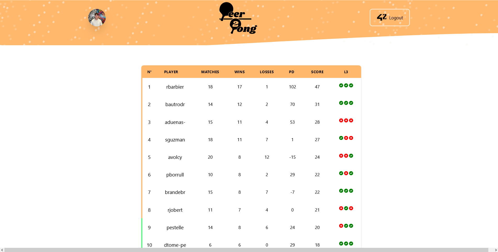

<br/>
<p align="center">
  <a href="https://github.com/San-tito/peer-2-pong">
    
  </a>

  <h2 align="center">🏓Peer2Pong🏓</h3>

  <p align="center">
    An Awesome Dashboard to manage the ping pong league!
    <br/>
    <br/>
    <a href="https://peer-2-pong.deno.dev/">View Demo</a>
    .
    <a href="https://github.com/San-tito/peer-2-pong/issues">Report Bug</a>
  </p>
</p>

## Table Of Contents

* [About the Project](#about-the-project)
* [Built With](#built-with)
* [Getting Started](#getting-started)
  * [Prerequisites](#prerequisites)
  * [Usage](#usage)
* [License](#license)

## About The Project



This project is a table tennis league dashboard 🏓🚀.

In this project, we use these technologies to provide a streamlined experience for managing a table tennis league. This includes functionalities such as player registration, match scheduling, score tracking, and ranking management 🎲🏆.

User access is managed through the `api.intra.42.fr` API, ensuring secure authentication 🔐🌐. Once users have logged in successfully, they can view the rankings table.

Match details are managed in a CSV file.  📊🗂️.

## Built With

[](https://fresh.deno.dev)

## Getting Started

### Prerequisites

Make sure to install Deno: https://deno.land/manual/getting_started/installation

### Usage

1. Setup env vars
```sh
cp .env.example .env
```

2. Start the project

```sh
deno task start
```

## License

Distributed under the MIT License. See [LICENSE](https://github.com/San-tito/peer-2-pong/blob/main/LICENSE.md) for more information.
